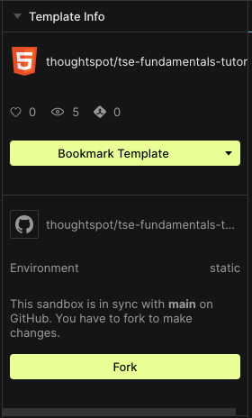
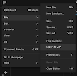

# ThoughtSpot Everywhere Fundamentals for Developers

This repository contains the training content for the ThoughtSpot Everywhere Fundamentals for Developers course.

File and folder structure:

* index.html - the main html file
* `./js` - contains the javascript for the application.
* `./js/tse.js` - the main javascript file for the application.
* `./css` - contains the css for the application.
* `./css/tse.css` - the main css file for the application.
* `./img` - contains the images for the application.
* `./js/backups/tse-final.js` - the reference for a final, completed version of `tse.js` at the end of the tutorial

## Running the application in CodeSandbox

The training content has been created as a sandbox in <a href="https://codesandbox.io/s/github/thoughtspot/tse-fundamentals-tutorial?file=/index.html" target="_blank">CodeSandbox</a> to make it easy to run and test. To edit the code, simply fork the sandbox and make your changes.

You can either create a CodeSandbox account, or choose the "Continue without an account" option at the bottom of the dialog that appears.

You can export your existing fork from CodeSandbox using the top left menu, then chooseing *File*->*Export to Zip*

## Running the application locally

This is a web application and will need to be deployed to a web server, but does not require anything more than the ability to serve files over http (no additional backend to install).  

Bring down the tutorial from GitHub, or export the fork you made in CodeSandox (see above) into a directory.

If you want to test locally, you can use something simple like the [Python http.server](https://docs.python.org/3/library/http.server.html):  

* Open up your command-line
* Change to the root folder of your downloaded project (where `index.html` exists) - either `cd` or `dir` depending on your environment
* Run `python3 -m http.server <port>`  (8000, 8080, or 3000 are all typical testing ports)  

## Completing the tutorial

The easiest way to generate code is to use the Developer Playground - go to the `DEVELOP` tab in ThoughtSpot, then click **Visual Embed SDK**->**Playground** in the left-side menu.

For each type of embedded component:

* Select the component type and the content that looks like what you want
* Press "Run" to see how it will look in the Playground
* Copy/paste the code from the code editor in the bottom left into your `tse.js` in the appropriate location
* Clean up the code within `tse.js` - make sure all the references to variables and element IDs match up to what actually exists in your `tse.js` and `index.html`

If you run into trouble, you can look at `./js/backups/tse-final.js` in this repository for a hint - but try your best to complete the exercises using only the Developer Playground and the documentation.

